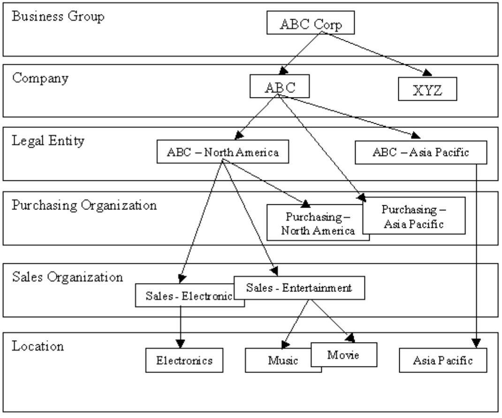

# 组织建模

组织相当于一个公司，部门，成本中心，销售单位或者其他任何有业务组织单元。典型的组织为:

* 企业集团
* 公司
* 法人
* 销售组织
* 采购组织
* 工厂及仓库

下图就是一个典型的组织建模。

</img>

* 企业集团

  在组织层次结构中的最高级别。它不会对会计带来影响。它包含一个或多个公司。

* 公司

  一个组织单元，按照有关法律规定要为其建立独立财务报表。
* 法人

  由地方政府确定为经营单位的自包含组织单元。通常在经营业务所在的每一个国家中建立他们。它包括记录所有相关交易，并生成财务报表的所有支持文档，如资产负债表和损益表。
* 销售组织

 负责产品和服务的配送销售。
* 采购组织

  也被称为买方组织。它负责将向厂商下采购订单。

* 工厂及仓库

  在货物配送前制造或储存货物的物理位置。一个供应链企业可以有多个工厂或仓库，几乎在所有组合中都关联到它的销售和采购组织。
